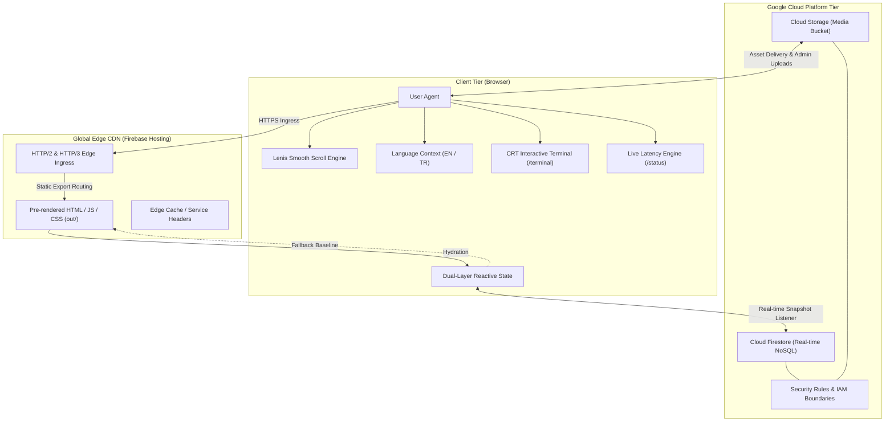
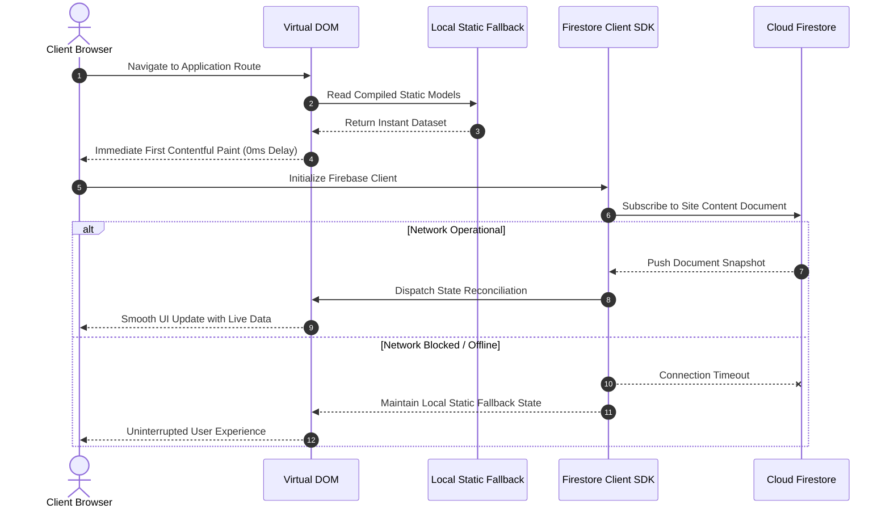
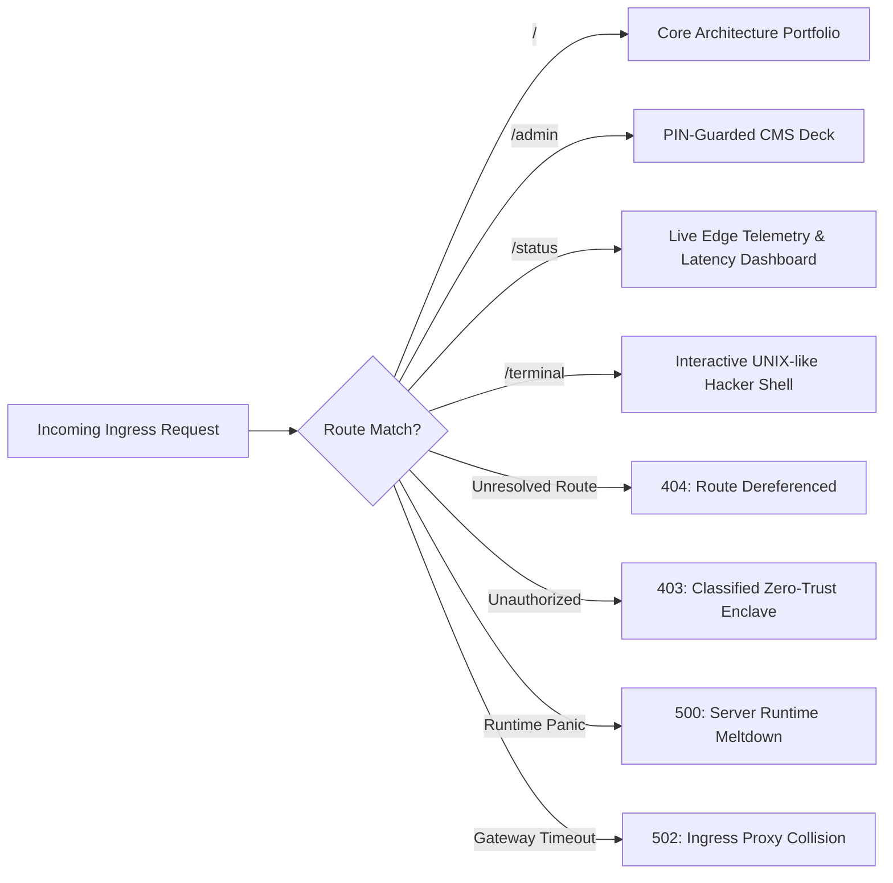
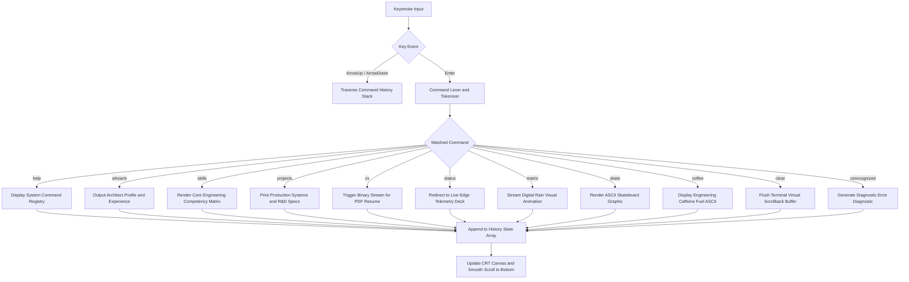

# BERKAY ACAR - ARCHITECTURAL PORTFOLIO SYSTEM

Distributed Full-Stack and Mobile Architecture Showcase. Built on Next.js 16, React 19, TypeScript, and Google Cloud Infrastructure.

---

## 1. Executive Overview

This repository houses the source code for the personal engineering portfolio and architecture console of Berkay Acar, Senior Full-Stack and Mobile Systems Architect.

The platform is designed around the principles of high-contrast Neo-Brutalism, sub-millisecond perceived latency, dual-layer state synchronization, and deterministic edge fault tolerance. Rather than acting as a passive static resume, the application functions as a reactive web system with an interactive terminal shell, live telemetry diagnostics, dynamic cloud content editing, and custom edge error handling.

Production URL: https://berkayacar.web.app

---

## 2. System Architecture and Distributed Topology

The application is deployed as a statically exported Next.js 16 bundle on Firebase Hosting global edge infrastructure, coupled with real-time reactive streams from Google Cloud Firestore and cloud-native asset storage.



---

## 3. Dual-Layer Persistence and Reactive Data Pipeline

The portfolio employs a dual-layer data delivery architecture:
1. Static Compilation Layer: Default datasets for metrics, credentials, case studies, and lab projects are compiled directly into the TypeScript bundle. This guarantees instant zero-latency first contentful paint (FCP) even under total network detachment.
2. Cloud Firestore Real-time Layer: Upon hydration, client-side listeners establish an encrypted WebSocket connection to Cloud Firestore. If newer data or live edits exist, state reconciles optimistically and updates UI nodes with zero full-page reload.



---

## 4. Edge Routing and Fault-Tolerant Status Hierarchy

The portfolio implements custom neo-brutalist error and telemetry surfaces across every critical HTTP boundary.



### Route and Diagnostics Matrix

| Path | Component | Status Classification | Primary Capabilities |
| :--- | :--- | :--- | :--- |
| `/` | `src/app/page.tsx` | Production Core | Hero, Metric Ribbon, Arsenal Bento, Case Studies, Lab R&D, Manifesto, Credentials |
| `/status` | `src/app/status/page.tsx` | Telemetry Dashboard | Real-time roundtrip ping measurement to edge CDN, memory telemetry, live uptime monitor |
| `/terminal` | `src/app/terminal/page.tsx` | Diagnostic CLI | CRT scanline shader, command history stack, command tokenization, ASCII headers |
| `/admin` | `src/app/admin/page.tsx` | Internal Control Deck | Secure PIN authentication, Firestore document mutation, Cloud Storage binary upload |
| `/404` | `src/app/not-found.tsx` | Route Dereferenced | Client telemetry dump (User-Agent, Viewport, Timestamp, Protocol), back-to-home recovery |
| `/403` | `src/app/403/page.tsx` | Access Forbidden | Zero-Trust IAM security clearance simulator, permission elevation override |
| `/500` | `src/app/500/page.tsx` | Runtime Meltdown | OutOfMemory simulation, emergency recovery protocol, instant container restart cycle |
| `/502` | `src/app/502/page.tsx` | Bad Gateway | Ingress proxy collision, hazard animated stripes, roundtrip ping diagnostic with retry |

---

## 5. Interactive Terminal Engine (/terminal)

The `/terminal` route provides a retro-futuristic CRT console allowing technical recruiters, engineering leaders, and developers to explore technical background via a standard Unix-like CLI interface.



---

## 6. Engineering Projects Featured

### Unicowallet - Autonomous Multi-Account Infrastructure
- Category: High-Concurrency Financial Tech & Distributed Systems
- Scale: 30,000+ Active Clients, sub-50ms transaction orchestration
- Architecture: .NET 8 Microservices, PostgreSQL, Redis caching, AES-256 encrypted payload channels
- Capabilities: Concurrent automated transaction workflows, automated retry mechanisms, circuit breakers, and fault recovery

### AEGIS - Autonomous Puzzle and Constraint Engine
- Category: Algorithmic Game Systems & Heuristic Evaluation
- Architecture: Unity, C#, Constraint Satisfaction Algorithms (CSP), State-Space Graph Traversal
- Capabilities: Deterministic level generation, real-time board validation, mathematical solvability proofs

### Cruwell's Vox - Spatial Audio Telemetry Mesh
- Category: Low-Latency Networked Communications
- Architecture: WebRTC, C#, WebSockets, Binary Audio Serialization
- Capabilities: Sub-20ms spatial positioning audio packets, jitter buffer mitigation, distributed mesh routing

### Tactical Football Sim - Deterministic Sports Physics
- Category: Simulation Engine & Sports Analytics
- Architecture: Custom State Synchronization, Spatial Partitioning, Event-Driven Architecture
- Capabilities: 22-agent spatial tactical decision engines, deterministic simulation cycles, live data visualization

### Chastity Virtual Museum - Interactive Spatial Gallery
- Category: WebGL Graphics & Spatial Web Interface
- Architecture: Three.js, WebGL Shaders, Next.js, Dynamic Asset Streaming
- Capabilities: GPU-accelerated 3D environment rendering, progressive texture LOD streaming, interactive architectural curation

---

## 7. Technology Stack

### Frontend Core
- Next.js 16.3.8 (App Router, Static Export configuration)
- React 19.3.0
- TypeScript 7.0.2 (Strict mode enforced)
- Tailwind CSS 4.3.3 (PostCSS integration)
- Phosphor Icons 2.1.10 (High-performance SVG icon primitives)

### Motion and Physics
- Lenis 1.3.26 (Smooth inertia scrolling engine)
- Motion 14.0.0 (Framer Motion derivative for spring-based mechanical transitions)
- Canvas-Confetti 1.9.4 (Interactive easter egg physics)

### Backend and Cloud Infrastructure
- Google Firebase Hosting (Global HTTP/2 CDN with static asset acceleration)
- Google Cloud Firestore (Real-time NoSQL document synchronization)
- Google Cloud Storage (Asset and binary media repository)
- Firebase Security Rules (Declarative read/write access constraints)

---

## 8. Directory Structure

```text
portfolio/
|-- .env.example              # Sanitized environment configuration template
|-- .gitignore                # Production ignore definitions
|-- firebase.json             # Firebase Hosting and Firestore deployment specs
|-- firestore.rules           # Security rules for document isolation
|-- next.config.mjs           # Next.js static export and image optimization flags
|-- package.json              # Dependency manifests and scripts
|-- tsconfig.json             # TypeScript strict compilation rules
|-- public/
|   |-- assets/               # Production case study imagery and project posters
|   `-- Berkay_Acar_Resume.pdf # Direct-access engineering curriculum vitae
`-- src/
    |-- context/
    |   `-- LanguageContext.tsx      # Dual-language i18n provider (EN / TR)
    |-- lib/
    |   `-- firebase.ts              # Firebase initialization and fallback data schemas
    |-- components/
    |   |-- AdminImageUploader.tsx   # Cloud Storage binary upload component
    |   |-- ArsenalBento.tsx         # Technical stack modular grid layout
    |   |-- CaseStudyPanels.tsx      # Deep-dive architecture showcase panels
    |   |-- ComicSkulls.tsx          # Custom SVG comic skull vector elements
    |   |-- CredentialsGrid.tsx      # Career timeline and leadership trajectory
    |   |-- FirebaseControlDeck.tsx  # Dynamic CMS live property editor
    |   |-- FooterSection.tsx        # Terminal links, social channels, and copyright
    |   |-- HeroSection.tsx          # High-impact typographic hero with Konami listener
    |   |-- LabShowcase.tsx          # R&D lab tabs, project links, and status badges
    |   |-- ManifestoSection.tsx     # Architectural philosophy and core principles
    |   |-- MetricRibbon.tsx         # Enterprise throughput and uptime ribbon
    |   |-- Navbar.tsx               # Sticky navigation with language switcher
    |   `-- SmoothScroll.tsx         # Lenis smooth-scrolling wrapper
    `-- app/
        |-- 403/page.tsx             # Access Forbidden diagnostic enclave
        |-- 404/page.tsx             # Custom 404 route
        |-- 500/page.tsx             # Server Runtime Meltdown simulation
        |-- 502/page.tsx             # Bad Gateway proxy collision diagnostic
        |-- admin/page.tsx           # Administrative CMS panel
        |-- globals.css              # Neo-brutalist custom utilities and tokens
        |-- layout.tsx               # Root application document layout
        |-- not-found.tsx            # Global Next.js fallback boundary
        |-- page.tsx                 # Core architectural showcase page
        |-- status/page.tsx          # Real-time system health and latency tester
        `-- terminal/page.tsx        # CRT interactive command line shell
```

---

## 9. Local Development and Build Commands

### Prerequisites
- Node.js 20.x or higher
- npm 10.x or higher
- Firebase CLI (for cloud deployments): `npm install -g firebase-tools`

### Installation
Clone the repository and install project dependencies:

```bash
git clone https://github.com/Berkawaii/portfolio.git
cd portfolio
npm install
```

### Environment Configuration
Copy the sanitized environment configuration template:

```bash
cp .env.example .env.local
```

Populate the required Firebase credentials within `.env.local`:
```ini
NEXT_PUBLIC_FIREBASE_API_KEY=your_api_key
NEXT_PUBLIC_FIREBASE_AUTH_DOMAIN=your_project.firebaseapp.com
NEXT_PUBLIC_FIREBASE_PROJECT_ID=your_project_id
NEXT_PUBLIC_FIREBASE_STORAGE_BUCKET=your_project.appspot.com
NEXT_PUBLIC_FIREBASE_MESSAGING_SENDER_ID=your_sender_id
NEXT_PUBLIC_FIREBASE_APP_ID=your_app_id
NEXT_PUBLIC_ADMIN_PIN=58575
```

### Execution Commands

```bash
# Start Next.js local development server
npm run dev

# Run static compilation and generate production bundle in /out
npm run build

# Deploy statically exported bundle directly to Firebase Hosting
firebase deploy --only hosting

# Deploy Firestore security rules
firebase deploy --only firestore:rules
```

---

## 10. Security and Disaster Recovery

1. Zero-Trust Access: The administrative portal (`/admin`) requires PIN clearance before unlocking write access to Firebase collections.
2. Read-Only Public Firestore Rules: Firestore rules are configured to permit public read access on verified schemas, with write and mutation operations restricted.
3. Decoupled Static Hosting: Even in the event of third-party cloud API downtime, the static client tier continues to deliver full CV, case study, and interactive terminal functionality without interruption.
4. Edge CDN Isolation: All static assets are served behind Google Cloud Armor DDOS protection and distributed across regional points of presence.

---

## 11. Author and Licensing

- Architect: Berkay Acar (Senior Full-Stack & Mobile Software Architect)
- Portfolio: https://berkayacar.web.app
- GitHub: https://github.com/Berkawaii
- LinkedIn: https://www.linkedin.com/in/im-berkay/
- License: MIT License - See LICENSE for terms.
